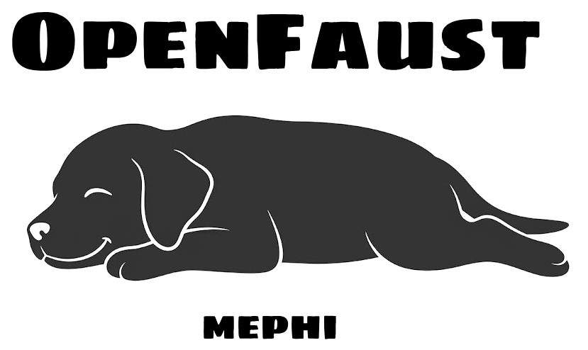
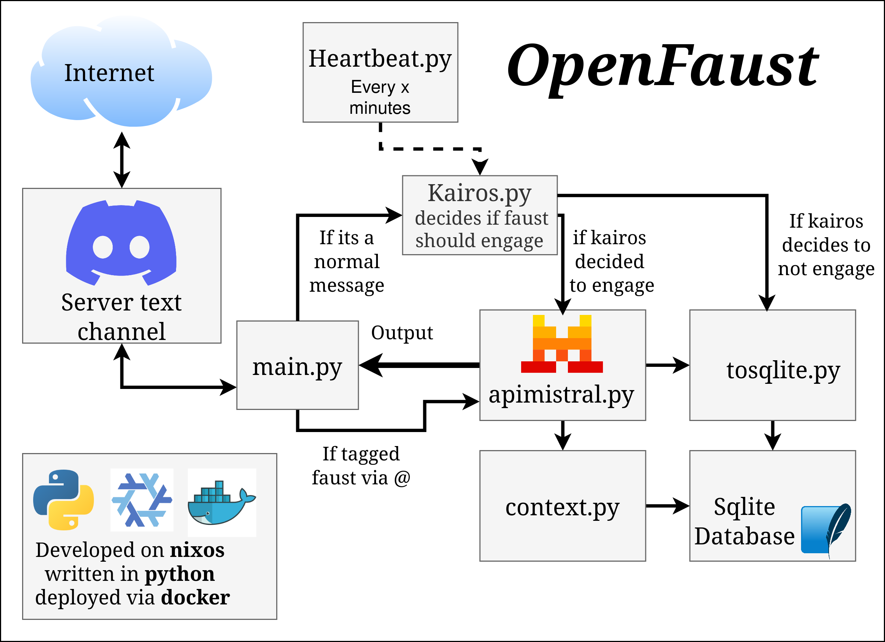

# 🦊 OpenFaust (v2)

 [In English 🇬🇧](README.md) | Po Polsku

---
Asynchroniczny, sterowany zdarzeniami (event-driven), wieloprocesowy framework asystenta AI stworzony dla platformy Discord. OpenFaust nie tylko biernie odpowiada na wiadomości — aktywnie monitoruje dynamikę konwersacji, autonomicznie decyduje, kiedy się zaangażować, i samoczynnie budzi się, aby przełamać długą ciszę za pomocą niestandardowego silnika routingu.

Rozwijany na **NixOS**, napisany w **Pythonie** i bezproblemowo wdrażany za pomocą **Dockera**.

---



## 🗺️ Architektura Systemu

Ekosystem składa się z odizolowanych modułów oddzielających główne zdarzenia Discorda, orkiestrację LLM oraz procesy działające w tle:

<<<<<<< HEAD
<<<<<<< HEAD

=======

>>>>>>> 082c2f3 (README.md is in a good state also added README_PL.md)
=======

>>>>>>> 029ae32 (Fixed link to diagram on polish version)

---

## ✨ Główne Funkcje

*   **🧠 Router Semantyczny Kairos:** Używa szybkiego, deterministycznego modelu (`gpt-4o-mini`) jako „kontrolera ruchu”, aby ocenić, czy wiadomość użytkownika wymaga odpowiedzi na podstawie czasu, bezpośrednich oznaczeń lub ciągłości konwersacji, zanim przekaże ją do cięższego modelu.
*   **💓 Odizolowana Pętla Heartbeat:** Proces w tle (`multiprocessing.Process`), całkowicie oddzielony od wątku Discorda, który co 30 minut ocenia ciszę na czacie i może autonomicznie wywołać interakcję.
*   **📂 Trwała Pamięć Lokalna:** Zasilana przez zoptymalizowaną bazę danych SQLite, która śledzi czystą, ustrukturyzowaną historię użytkowników oraz kontekst metadanych.
*   **🎭 Dynamiczny Silnik Persony:** Całkowicie niezależny od osobowości. Wystarczy wrzucić dowolny profil w formacie Markdown do katalogu danych, a framework automatycznie wyodrębni tożsamość i dopasuje logikę routingu.

---

## 🚀 Szybki Start

### 1. Konfiguracja Środowiska
Utwórz plik `.env` w katalogu głównym:

```env
DISCORD_TOKEN=twoj_token_bota_discord
OPENROUTER_API_KEY=twoj_klucz_api_openrouter
APP_DATA_PATH=/app/data
APP_PERSONALITY_PATH=/app/data/personality.md
```

### 2. Konfiguracja Docker Compose
Utwórz plik `docker-compose.yml` w katalogu głównym:

```yaml
services:
  openfaust:
    build: .
    container_name: openfaust
    restart: unless-stopped
    env_file:
      - .env  
    volumes:
      - ./data:/app/data
```

### 3. Uruchomienie Frameworku
Uruchom skonteneryzowaną aplikację w trybie odizolowanym (detached mode):

```bash
docker compose up -d
```

---

## 🎭 Dynamiczna Personalizacja Osobowości

Aby dynamicznie zmienić profil zachowania bota:

1. Zatrzymaj bieżący kontener wdrożeniowy:
   ```bash
   docker compose stop
   ```
2. Otwórz i zmodyfikuj plik `./data/personality.md` (lub ścieżkę do własnego pliku, jeśli została zmieniona), aby zaprojektować nowe reguły promptu osobowości.
3. Uruchom framework ponownie:
   ```bash
   docker compose up -d
   ```

---

## 🛠️ Moje Wybory Projektowe

### 🐍 Python
> Zdecydowałem się na użycie Pythona, ponieważ mam w nim największe doświadczenie i lubię z niego korzystać. Posiada on również świetne biblioteki do obsługi Discorda oraz API modeli.

### 🧠 Router Kairos & Heartbeat
> Dodałem Kairosa, aby OpenFaust brzmiał bardziej ludzko, pozwalając mu na autonomiczną interakcję z użytkownikami, jednocześnie obniżając koszty API.

### 🗄️ SQLite & Kontekst
> Wybrałem SQLite, ponieważ działa w oparciu o jeden plik i dobrze radzi sobie z formatem JSON. Potrzebowałem bazy danych do trwałego przechowywania danych i zarządzania kontekstem, ponieważ kontenery Dockera są domyślnie bezstanowe (stateless).

### 🐋 Wieloprocesowa Konteneryzacja (Docker)
> Zdecydowałem się na Dockera, ponieważ cenię sobie jego prostotę działania (plug-and-play), a ponadto zapewnia on solidne bezpieczeństwo, izolację i bezproblemowe zarządzanie.

### 🌐 Hosting & Wdrożenie (OCI & NixOS)
> Projekt rozwijałem na NixOS i mój serwer również działa pod kontrolą NixOS, ponieważ uwielbiam ten system operacyjny i uważam, że jest wysoce niedoceniany zarówno do programowania, jak i jako dystrybucja serwerowa. Obydwie usługi hostuję na OCI (Oracle Cloud Infrastructure), ponieważ oferuje ono bardzo hojną darmową strefę (free tier), a samą platformę znałem już wcześniej dzięki mojemu certyfikatowi.

---

## LICENCJA

*   **Ten projekt jest licencjonowany na warunkach licencji GNU Affero General Public License v3.0 - szczegóły znajdziesz w pliku [LICENSE](LICENSE).** 
*   **Copyright (c) 2026 dawid2077**
